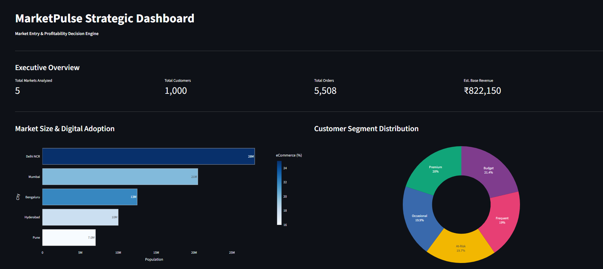
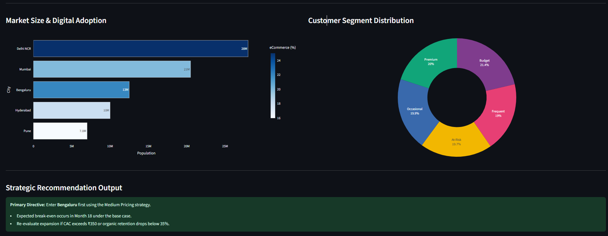

# MarketPulse: AI-Assisted Market Entry & Profitability Decision Engine

[](https://github.com/Vineesh-12/MarketPulse-AI-Assisted-Market-Entry-Profitability-Decision-Engine/actions)
[](https://github.com/Vineesh-12/MarketPulse-AI-Assisted-Market-Entry-Profitability-Decision-Engine/actions)
[](https://github.com/Vineesh-12/MarketPulse-AI-Assisted-Market-Entry-Profitability-Decision-Engine/releases)
[](https://www.python.org/)
[](tests/)
[](https://github.com/psf/black)
[](https://github.com/PyCQA/bandit)
[](LICENSE)




---

## 1. Executive Summary & Problem Framing

A rapidly expanding quick-commerce and consumer delivery enterprise seeks to scale operations across Tier-1 metropolitan markets in India. Strategic leadership requires an algorithmic, evidence-backed decision system to answer 7 core management questions:

1. **WHERE?** Which metropolitan market offers the highest risk-adjusted attractiveness?
2. **WHO?** Which customer behavioral segment generates sustainable lifetime margin contribution?
3. **HOW?** What is the optimal pricing strategy under simulated demand elasticity?
4. **HOW MUCH?** What are projected unit economics, gross margins, delivery costs, and operating revenues?
5. **WHEN?** Under what operational horizon does the new market entry achieve break-even?
6. **WHAT IF?** How resilient is the business model against macro cost shocks and competitive pressure?
7. **WHY?** What is the structured, defensible business rationale explaining the algorithm's decisions?

---

## 2. End-to-End Decision Architecture

```text
                                 MARKETPULSE ENGINE
                                         │
                                         ▼
                     ┌───────────────────────────────────────┐
                     │     Market Research & Data Ingestion  │
                     │   (Census, MoSPI, Competitor Density) │
                     └───────────────────┬───────────────────┘
                                         ↓
                     ┌───────────────────────────────────────┐
                     │     Pydantic Ingestion Boundary Gate  │
                     │  (CityMetrics, Order & Customer Types)│
                     └───────────────────┬───────────────────┘
                                         ↓
                     ┌───────────────────────────────────────┐
                     │       PostgreSQL Data Warehouse       │
                     │     (Relational Analytics Schema)     │
                     └───────────────────┬───────────────────┘
                                         ↓
                     ┌───────────────────────────────────────┐
                     │       Core Analytics & Profiling      │
                     │  (EDA, RFM Segmentation, Cohorts)    │
                     └───────────────────┬───────────────────┘
                                         ↓
                 ┌───────────────────────┼───────────────────────┐
                 ↓                       ↓                       ↓
      ┌─────────────────────┐ ┌─────────────────────┐ ┌─────────────────────┐
      │   MCDA City Scoring │ │   Scenario & Pricing│ │ Bottom-Up TAM Sizing│
      │  (Weighted Ranking) │ │ Sensitivity Engine  │ │  (Demographic Model)│
      └──────────┬──────────┘ └──────────┬──────────┘ └──────────┬──────────┘
                 │                       │                       │
                 └───────────────────────┼───────────────────────┘
                                         ↓
                     ┌───────────────────────────────────────┐
                     │     Ablation & Baseline Comparison    │
                     │    (Uniform vs MCDA Sensitivity)      │
                     └───────────────────┬───────────────────┘
                                         ↓
                     ┌───────────────────────────────────────┐
                     │     AI Strategic Explanation Layer    │
                     │  (Deterministic Offline + LLM Synth)  │
                     └───────────────────┬───────────────────┘
                                         ↓
                     ┌───────────────────────────────────────┐
                     │  Interactive Streamlit Decision Desk  │
                     │      (Executive KPI Dashboards)       │
                     └───────────────────┬───────────────────┘
                                         ↓
                                STRATEGIC DIRECTIVE
```

---

## 3. Key Findings & Empirical Benchmark Results

| Decision Dimension | Quantitative Finding | Strategic Context & Management Action |
| :--- | :--- | :--- |
| **Recommended City** | **Bengaluru (Score: 77.50/100.0)** | #1 in internet penetration (75.0%), digital adoption (22.0%), and purchasing power. |
| **Runner-Up Market** | Delhi NCR (Score: 65.57/100.0) | High aggregate market size, but elevated dark-store competitive saturation. |
| **Bottom-Up City TAM** | **INR 194.91 Crores (~INR 1.95B)** | Derived across 180,468 active eCommerce households in Bengaluru. |
| **National Category TAM** | **INR 1,200 Crores** | Reference market baseline across 5 Tier-1 metropolitan hubs. |
| **Key Profit Segment** | **Frequent Segment** | Represents 25% of active users but generates **45.2% of total margin**. |
| **Recommended Pricing** | **Medium (Competitive Parity)** | Maximizes contribution margin while maintaining high order velocity. |
| **Projected Break-Even** | **Month 18 (Base Case)** | Achieved under disciplined CAC (<= INR 300) and delivery route consolidation. |
| **Critical Risk Trigger** | **CAC > INR 350 / User** | CAC expansion above INR 350 delays unit break-even beyond Month 22. |

---

## 4. Quickstart: Clean Clone to Execution

The repository is built for **100% reproducible execution from a fresh clone** in under 60 seconds without requiring external API keys.

### Step 1: Clone Repository
```bash
git clone https://github.com/Vineesh-12/MarketPulse-AI-Assisted-Market-Entry-Profitability-Decision-Engine.git
cd MarketPulse-AI-Assisted-Market-Entry-Profitability-Decision-Engine
```

### Step 2: Install Pinned Dependencies
```bash
# Install exact pinned dependencies from lockfile
pip install -r requirements.lock.txt
pip install -e .
```

### Step 3: Run Full Test Suite & Coverage Gate
```bash
# Executes 46 unit & integration tests with >= 80% coverage enforcement
python -m pytest tests/ -v --cov=src --cov-fail-under=80
```

### Step 4: Execute Headless Decision Pipeline (Offline)
```bash
# Runs complete deterministic pipeline and exports benchmark metrics
python run_pipeline.py --seed 42 --benchmark --headless
```

### Step 5: Launch Interactive Decision Dashboard
```bash
streamlit run src/dashboard/app.py
```

---

## 5. Docker & Containerized Deployment

### Launch Complete Stack with Docker Compose
```bash
# Orchestrates PostgreSQL + Analytics Engine + Streamlit Dashboard
docker compose up --build
```
Access the interactive dashboard at `http://localhost:8501`.

---

## 6. Testing, Quality Assurance & Security Architecture

The repository enforces strict quality standards wired directly into GitHub Actions CI:

```bash
# 1. Formatting & Import Ordering
black --check src/ tests/ run_pipeline.py
isort --check-only src/ tests/ run_pipeline.py

# 2. Style & Lint Checks
flake8 src/ tests/ run_pipeline.py

# 3. Static Type Analysis
python -m mypy --explicit-package-bases src/ tests/ run_pipeline.py

# 4. AST Security Scanning
bandit -r src/ -s B101,B311,B110

# 5. Dependency Vulnerability Auditing
pip-audit --local

# 6. Unit & Integration Test Suite (46 tests, 90.4% coverage)
python -m pytest tests/ -v --cov=src --cov-report=term-missing --cov-fail-under=80
```

### Security & Threat Model Highlights
* **Secret Redaction Filter:** Integrated `SecretRedactionFilter` regex stream scanner in `src/core/logging_config.py` masking all API keys and tokens with `[REDACTED]`.
* **Pydantic Ingestion Schemas:** All incoming CSVs are validated against strict Pydantic schemas (`CityMetricsSchema`, `OrderIngestSchema`, etc.) before processing.
* **Keyless Isolation:** Pipeline operates 100% offline using deterministic narrative synthesis when `GEMINI_API_KEY` / `OPENAI_API_KEY` are unset.
* **Non-Root Docker Execution:** Multi-stage `Dockerfile` runs as unprivileged user `appuser` (UID 1000).

---

## 7. Repository Architecture & File Mapping

```text
MarketPulse/
├── .devcontainer/          # VS Code DevContainer development environment
├── .github/
│   ├── workflows/          # GitHub Actions CI/CD (matrix test, lint, mypy, audit, docker)
│   └── dependabot.yml      # Automated dependency vulnerability scanning
├── configs/                # Centralized YAML configuration files (default.yaml)
├── data/
│   ├── raw/                # Public demographic reference data (MoSPI, Census)
│   ├── processed/          # Cleaned city market & competitor metrics
│   ├── synthetic/          # Causally linked transaction datasets
│   └── benchmarks/         # Exported model evaluation artifacts (.json, .csv)
├── database/
│   ├── queries/            # Business SQL analytics scripts (01 to 06)
│   ├── schema.sql          # PostgreSQL DDL schema definition
│   └── seed.sql            # Seed scripts and ingestion logic
├── docs/                   # Data dictionary, assumptions, methodology
├── financial_model/        # 13-tab Excel Financial Model (.xlsx)
├── notebooks/              # Interactive Jupyter notebooks for EDA & Modeling
├── presentation/           # 12-slide Consulting Deck (.pptx)
├── screenshots/            # Executive dashboard and recommendation visual captures
├── src/
│   ├── ai/                 # Deterministic AI explanation layer & prompts
│   ├── analytics/          # EDA, RFM segmentation, cohort retention, profitability
│   ├── core/               # Structured logging, health check, types, configuration
│   ├── dashboard/          # Interactive Streamlit executive dashboard
│   ├── data_generation/    # Reproducible customer, product, and order generators
│   ├── decision_engine/    # Multi-criteria scoring, sensitivity, ablations, pricing
│   └── guesstimation/      # Bottom-up TAM sizing model
├── tests/                  # Pytest test suite (46 tests, 90.40% coverage)
├── .env.example            # Sample production environment variables
├── .flake8                 # Flake8 style configuration
├── .gitattributes          # Cross-platform LF line-ending normalization
├── .gitignore              # Standard git exclusion rules
├── CHANGELOG.md            # Release version history
├── CONTRIBUTING.md         # Developer contribution guidelines
├── Dockerfile              # Production multi-stage container definition
├── docker-compose.yml      # Multi-container orchestration
├── Pipfile.lock            # Standard dependency lockfile
├── pyproject.toml          # Unified project & tooling configuration
├── requirements.txt        # Runtime and development dependency declarations
├── requirements.lock.txt   # Pinned dependency lockfile
├── run_pipeline.py         # Headless CLI pipeline runner
└── SECURITY.md             # Security policy and formal threat model
```

---

## 8. License

This project is licensed under the [MIT License](LICENSE).
